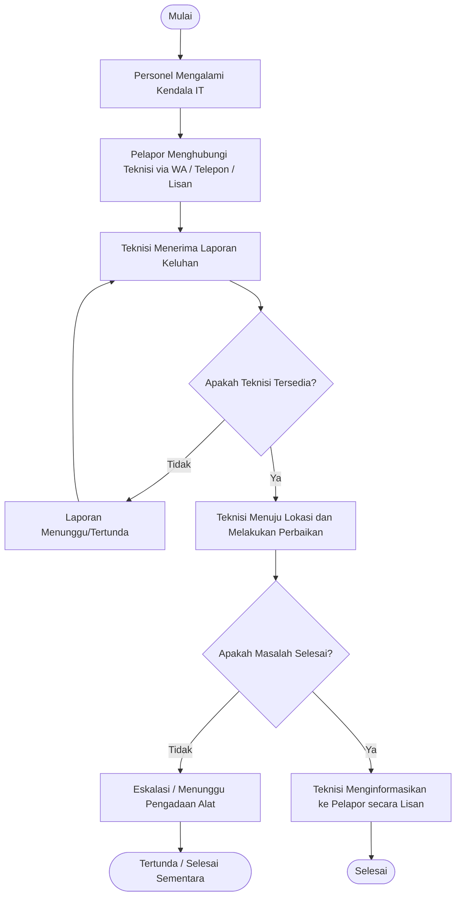

# BAB I PENDAHULUAN

## 1.1 Latar Belakang Masalah
Perkembangan teknologi informasi saat ini telah memberikan dampak yang signifikan terhadap berbagai sektor, termasuk instansi pemerintahan dan kepolisian. Kepolisian Resor Metropolitan (Polres Metro) Bekasi sebagai instansi yang bertugas memelihara keamanan dan ketertiban masyarakat, penegakan hukum, serta memberikan perlindungan, pengayoman, dan pelayanan kepada masyarakat, sangat bergantung pada infrastruktur Teknologi Informasi (IT) dalam menjalankan operasional sehari-hari. Berbagai perangkat keras (hardware), perangkat lunak (software), maupun jaringan internet digunakan untuk mendukung kinerja personel.

Namun, seiring dengan tingginya intensitas penggunaan perangkat IT, masalah teknis atau kerusakan sering kali terjadi, seperti kendala jaringan internet, kerusakan printer, komputer error, hingga masalah pada aplikasi internal. Saat ini, proses pelaporan masalah IT di Polres Metro Bekasi masih dilakukan secara konvensional, yaitu personel yang mengalami kendala menghubungi bagian IT atau teknisi melalui pesan singkat (WhatsApp), panggilan telepon, atau bahkan datang langsung ke ruangan IT. 

Proses pelaporan seperti ini memiliki beberapa kelemahan, di antaranya adalah sulitnya melacak sejauh mana progres penyelesaian masalah (tracking), tidak adanya dokumentasi laporan yang terpusat, dan teknisi kesulitan dalam menentukan prioritas penanganan karena laporan yang masuk tidak terstruktur. Selain itu, pimpinan juga kesulitan dalam mengevaluasi kinerja layanan IT maupun mengidentifikasi perangkat yang sering mengalami kerusakan karena tidak adanya rekapitulasi data yang baik.

Berdasarkan permasalahan tersebut, maka diperlukan sebuah sistem yang dapat mengelola dan mendokumentasikan setiap keluhan atau laporan kerusakan secara sistematis. Oleh karena itu, penulis tertarik untuk mengambil judul **"Perancangan Sistem Tiket Laporan IT Berbasis Web di Polres Metro Bekasi"**. Sistem helpdesk ticketing ini diharapkan dapat menjadi solusi untuk mempermudah personel dalam melaporkan kendala IT, serta membantu tim IT dalam mengelola, memantau, dan menyelesaikan setiap laporan secara terstruktur, efektif, dan efisien.

## 1.2 Identifikasi Masalah
Berdasarkan latar belakang masalah yang telah diuraikan, maka dapat diidentifikasi beberapa permasalahan sebagai berikut:
1. Proses pelaporan masalah dan kerusakan perangkat IT masih dilakukan secara tidak terstruktur melalui pesan singkat (WhatsApp), telepon, atau lisan, sehingga rentan terjadi informasi yang terlewat atau lupa ditangani.
2. Belum adanya sistem yang dapat melacak status penyelesaian suatu laporan kerusakan IT secara real-time bagi pihak pelapor.
3. Teknisi kesulitan dalam mengatur skala prioritas penanganan karena laporan tidak terpusat dalam satu wadah.
4. Tidak adanya rekapitulasi data riwayat kerusakan atau keluhan IT yang tercatat dengan baik untuk keperluan pelaporan dan evaluasi manajemen.

## 1.3 Batasan Masalah
Agar pembahasan tidak menyimpang dan lebih terarah, maka batasan masalah dalam penelitian ini adalah:
1. Sistem helpdesk ticketing yang dirancang berbasis web dan hanya dapat diakses melalui jaringan intranet atau internet.
2. Sistem ini diimplementasikan khusus untuk studi kasus di lingkungan operasional Polres Metro Bekasi.
3. Pengguna sistem dibagi menjadi hak akses (role), yaitu Pelapor (Personel/Anggota Polres), Teknisi (IT Support), dan Administrator.
4. Fitur utama aplikasi mencakup pembuatan tiket keluhan (create ticket), pembaruan status penyelesaian (open, in progress, resolved, closed), notifikasi, serta laporan rekapitulasi tiket.
5. Sistem ini difokuskan pada penanganan laporan insiden (incident management) keluhan IT.

## 1.4 Rumusan Masalah
Berdasarkan latar belakang dan identifikasi masalah, maka rumusan masalah dalam penelitian ini adalah:
1. Bagaimana merancang dan membangun Sistem Tiket Laporan IT (Helpdesk) berbasis web di Polres Metro Bekasi?
2. Bagaimana mengimplementasikan sistem yang dapat memudahkan personel dalam melaporkan kendala IT dan memantau status penyelesaiannya?
3. Bagaimana membangun sistem yang dapat membantu tim IT dalam mengelola, mendokumentasikan, serta menghasilkan laporan rekapitulasi keluhan secara otomatis?

## 1.5 Tujuan Penelitian
Tujuan dari penelitian dan pembuatan sistem ini adalah:
1. Merancang dan mengimplementasikan aplikasi Helpdesk Ticketing System berbasis web pada Polres Metro Bekasi.
2. Mempermudah dan mempercepat proses pelaporan gangguan IT bagi seluruh personel.
3. Memberikan kemudahan bagi tim IT dalam mengorganisir, memonitor, dan menindaklanjuti laporan yang masuk secara sistematis.
4. Menyediakan fasilitas pelaporan (reporting) yang akurat mengenai data kerusakan dan kinerja penanganan IT sebagai bahan evaluasi pimpinan.

## 1.6 Manfaat Penelitian
Manfaat yang diharapkan dari penelitian ini adalah:
1. **Bagi Instansi (Polres Metro Bekasi):**
   * Meningkatkan efektivitas dan efisiensi pelayanan dukungan IT di lingkungan internal.
   * Mengurangi waktu henti (downtime) akibat kerusakan perangkat karena penanganan menjadi lebih cepat dan terstruktur.
   * Memudahkan pimpinan dalam melakukan monitoring kinerja pelayanan IT melalui data laporan yang terpusat.
2. **Bagi Penulis:**
   * Menerapkan ilmu pengetahuan yang telah diperoleh selama perkuliahan ke dalam studi kasus nyata di dunia kerja.
   * Menambah wawasan dan pengalaman praktis dalam merancang dan mengembangkan sistem informasi berbasis web.
3. **Bagi Akademis / Peneliti Selanjutnya:**
   * Menjadi referensi atau bahan rujukan bagi pihak lain yang akan melakukan penelitian sejenis di bidang sistem informasi helpdesk.

---

# BAB II KAJIAN PUSTAKA DAN LANDASAN TEORI

## 2.1 Kajian Pustaka
Dalam perancangan sistem ini, merujuk pada beberapa penelitian terdahulu yang relevan sebagai bahan perbandingan dan referensi terkait perancangan sistem helpdesk ticketing. Secara umum, penelitian terdahulu menunjukkan bahwa penerapan sistem ticketing terkomputerisasi dapat menurunkan waktu respons (response time) teknisi secara signifikan, meningkatkan transparansi informasi, dan meningkatkan kepuasan pengguna (user) terhadap layanan departemen IT dibandingkan dengan pencatatan keluhan secara manual. *(Catatan: Tambahkan sitasi jurnal referensi KP Anda disini jika ada).*

## 2.2 Landasan Teori

### 2.2.1 Pengertian Sistem Informasi
Sistem informasi adalah suatu sistem di dalam suatu organisasi yang mempertemukan kebutuhan pengolahan transaksi harian, mendukung operasi, bersifat manajerial dan kegiatan strategi dari suatu organisasi dan menyediakan pihak luar tertentu dengan laporan-laporan yang diperlukan untuk pengambilan keputusan.

### 2.2.2 Helpdesk dan Ticketing System
* **Helpdesk:** Merupakan suatu bagian atau departemen dalam suatu perusahaan atau institusi yang bertugas untuk melayani dan menanggapi pertanyaan, keluhan, serta memberikan solusi atas permasalahan teknis yang dialami oleh pengguna terkait dengan operasional infrastruktur atau layanan IT.
* **Ticketing System:** Adalah perangkat lunak (software) yang digunakan oleh layanan pelanggan atau tim IT untuk menangani, mengelola, dan melacak daftar masalah pengguna dari pengajuan (open) hingga penyelesaian (closed). Setiap laporan yang masuk akan direpresentasikan sebagai sebuah "tiket" yang memiliki nomor antrean atau nomor unik referensi.

### 2.2.3 Konsep Pengembangan Web
* **HTML (Hypertext Markup Language):** Bahasa markah standar yang digunakan untuk membuat dan menyusun struktur halaman web.
* **CSS (Cascading Style Sheets):** Bahasa yang digunakan untuk mengatur tampilan dan format halaman web yang telah dibuat dengan HTML, sehingga antarmuka sistem menjadi lebih responsif dan mudah digunakan (User Friendly).
* **JavaScript:** Bahasa pemrograman tingkat tinggi yang digunakan untuk membuat halaman web menjadi interaktif dan dinamis, seperti pada fitur notifikasi real-time.
* **Database Relasional:** Sistem Manajemen Basis Data (seperti MySQL/MariaDB) yang digunakan untuk menyimpan, mengelola, dan mengambil relasi data pada sistem tiket, seperti data pengguna, data departemen, riwayat status tiket, dan log aktivitas.

### 2.2.4 Framework Pengembangan Terkait
Sistem ini dikembangkan dengan mengadopsi arsitektur yang terstruktur (seperti Model-View-Controller) yang memisahkan antara logika bisnis (backend), representasi antarmuka (frontend), dan interaksi database, sehingga proses perancangan, pengembangan, dan pemeliharaan sistem di masa mendatang menjadi lebih mudah dan rapi.

---

# BAB III METODOLOGI PENELITIAN DAN ANALISA SISTEM

## 3.1 Sejarah Singkat dan Profil Perusahaan
Kepolisian Resor Metropolitan Bekasi (Polres Metro Bekasi) adalah satuan pelaksana tugas Kepolisian Negara Republik Indonesia di wilayah tingkat Kabupaten/Kota Bekasi. Polres Metro Bekasi berada di bawah naungan Kepolisian Daerah Metropolitan Jakarta Raya (Polda Metro Jaya). Tugas utama Polres Metro Bekasi meliputi penyelenggaraan tugas kepolisian di bidang pemeliharaan keamanan dan ketertiban masyarakat, penegakan hukum, serta memberikan perlindungan, pengayoman, dan pelayanan kepada masyarakat.

Dukungan operasional Teknologi Informasi memegang peran vital, dikelola oleh Seksi Teknologi Informasi dan Komunikasi (Seksi TIK/SITIK). Seksi TIK bertugas memfasilitasi kebutuhan sarana prasana komputer, jaringan internet/intranet, serta pengelolaan sistem aplikasi internal kepolisian untuk seluruh satuan kerja di Polres Metro Bekasi.

## 3.2 Visi dan Misi
*(Catatan: Anda dapat menyesuaikan visi misi ini dengan visi misi resmi Polres Metro Bekasi yang terbaru)*
**Visi:**
Terwujudnya pelayanan keamanan dan ketertiban masyarakat yang prima, tegaknya hukum dan keamanan dalam negeri yang mantap serta terjalinnya sinergi polisional yang proaktif di wilayah hukum Polres Metro Bekasi.

**Misi:**
1. Memberikan perlindungan, pengayoman, dan pelayanan secara mudah, responsif, dan tidak diskriminatif.
2. Memelihara keamanan dan ketertiban masyarakat dengan tetap menjunjung tinggi hak asasi manusia.
3. Menyelenggarakan penegakan hukum yang profesional dan berkeadilan.
4. Mengelola sumber daya manusia dan teknologi informasi yang profesional, modern, dan terpercaya guna mendukung operasional kepolisian yang presisi.

## 3.3 Struktur Organisasi
*(Catatan: Anda perlu melampirkan gambar struktur organisasi Polres Metro Bekasi secara umum, atau secara spesifik pada bagian Seksi Teknologi Informasi / Seksi TIK di bagian ini di dokumen Word akhir Anda).*

Berikut adalah gambaran umum hierarki yang relevan dengan bagian TIK:
- Kepala Kepolisian Resor (Kapolres)
  - Kepala Seksi Teknologi Informasi dan Komunikasi (Kasi TIK)
    - Perwira Urusan Teknologi Komunikasi (Paur Tekkom)
    - Staf / Bintara IT (Sebagai Teknisi / Support)
    - Personel Anggota Polres (Sebagai Pengguna / Pelapor)

## 3.4 Analisa Permasalahan
Berdasarkan hasil observasi pada sistem yang berjalan saat ini di Polres Metro Bekasi, proses pelaporan masalah IT dari unit kerja ke bagian Seksi TIK masih dilakukan secara manual. Apabila seorang personel di satuan fungsi tertentu mengalami kendala IT (misal: komputer mati, jaringan internet putus, printer rusak, atau akun aplikasi terkendala), mereka akan menghubungi teknisi IT melalui aplikasi pesan singkat (WhatsApp), menelepon, atau mendatangi langsung ruangan IT. 

Analisa dari permasalahan sistem yang sedang berjalan ini antara lain:
1. **Kehilangan Informasi (Missed Reports):** Laporan via pesan WhatsApp mudah tertumpuk dengan obrolan lain, sehingga teknisi sering terlewat, lupa, atau terlambat untuk menangani keluhan tersebut.
2. **Kurangnya Transparansi Status:** Pihak pelapor tidak mengetahui secara pasti apakah masalahnya sedang ditangani, tertunda karena menunggu penggantian perangkat, atau sudah selesai, karena tidak ada sistem tracking.
3. **Ketidakefisienan Evaluasi (Reporting):** Kasi TIK kesulitan memantau beban kerja masing-masing teknisi dan tidak memiliki data akurat terkait statistik gangguan (misal: perangkat apa yang paling sering rusak bulan ini). Rekapitulasi pelaporan harus direkap manual yang memakan banyak waktu.

## 3.5 Flowchart Sistem Yang Berjalan

Sistem pelaporan masalah IT yang saat ini sedang berjalan dapat digambarkan melalui alur diagram flowchart berikut:



**Keterangan Flowchart Sistem Berjalan:**
1. Pelapor yang mengalami kendala IT secara inisiatif mencari dan menghubungi teknisi.
2. Teknisi menerima laporan, seringkali tanpa mencatatnya secara terpusat.
3. Jika teknisi sedang sibuk, penanganan ditunda tanpa ada pemberitahuan sistematis ke pelapor.
4. Jika masalah terselesaikan, konfirmasi penyelesaian hanya dilakukan via obrolan/lisan tanpa ada riwayat pengerjaan (history log) yang diarsipkan dengan baik.

## 3.6 Flowchart Sistem Usulan

Untuk mengatasi berbagai kelemahan pada sistem yang berjalan, diusulkan sebuah "Sistem Tiket Laporan IT Berbasis Web". Berikut adalah alur proses (flowchart) pada sistem yang diusulkan:

```mermaid
flowchart TD
    Start([Mulai]) --> LoginUser[Pelapor Melakukan Login ke Aplikasi]
    LoginUser --> BuatTiket[Pelapor Mengisi Form 'Buat Tiket Baru' (Judul, Deskripsi, Foto)]
    BuatTiket --> SimpanDB[(Sistem Menyimpan Data Tiket)]
    
    SimpanDB --> NotifAdmin[Sistem Update Daftar Tiket Baru]
    NotifAdmin --> LoginTeknisi[Teknisi Melakukan Login ke Aplikasi]
    
    LoginTeknisi --> LihatTiket[Teknisi Melihat Daftar Tiket Berstatus 'Open']
    LihatTiket --> AmbilTiket[Teknisi Mengambil Tiket & Update Status menjadi 'In Progress']
    
    AmbilTiket --> Proses[Teknisi Melakukan Tindakan Perbaikan]
    Proses --> Evaluasi{Apakah Perbaikan Selesai?}
    
    Evaluasi -- Tidak --> UpdateTertunda[Teknisi Mengupdate Status menjadi 'Pending' beserta Alasan]
    UpdateTertunda --> Proses
    
    Evaluasi -- Ya --> UpdateSelesai[Teknisi Mengupdate Status menjadi 'Resolved' / 'Closed']
    UpdateSelesai --> TulisSolusi[Teknisi Menginput Catatan Solusi / Penyelesaian]
    TulisSolusi --> UpdateDB[(Database Diperbarui)]
    
    UpdateDB --> NotifUser[Pelapor Dapat Melihat Status Tiket Selesai di Dashboard]
    NotifUser --> End([Selesai])
```

**Keterangan Flowchart Sistem Usulan:**
1. Pelapor tidak perlu lagi chat manual; cukup login ke aplikasi dan membuat tiket keluhan, melampirkan detail masalah dan foto jika diperlukan.
2. Laporan tersimpan di database dan secara otomatis berstatus **"Open"**.
3. Teknisi memantau daftar tiket masuk dan mengambil tiket tersebut. Status tiket akan berubah menjadi **"In Progress"**. Pelapor bisa melihat perubahan status ini secara *real-time* di layar komputernya.
4. Jika terdapat kendala lama (misal: order alat), status dapat diubah ke **"Pending"** dengan mencantumkan alasan.
5. Setelah masalah teratasi, teknisi menutup tiket (**"Closed"**) dan wajib menyertakan catatan solusi. 
6. Rekam jejak waktu mulai pelaporan hingga selesai (SLA) terekam otomatis di sistem dan dapat diekspor menjadi laporan rekapitulasi data (Excel/PDF) oleh Admin.
